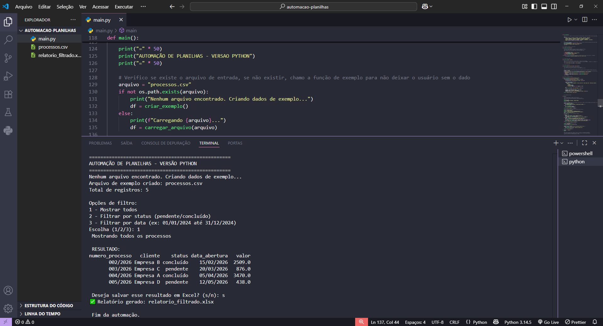
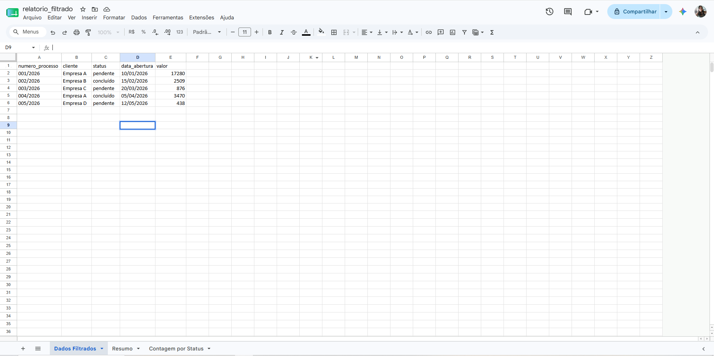

# 📊 Automação de Planilhas – Análise de Processos

**Autora:** Jéssica Oliveira  
**Tecnologias:** Python, Pandas, OpenPyXL  

---

##  Visão Geral

Este script foi desenvolvido como parte do meu portfólio para a **vaga de Estágio em TI**. Ele automatiza a leitura, filtragem e geração de relatórios a partir de planilhas de processos/intimações.

**Objetivo principal:** demonstrar habilidades em automação de dados, tratamento de planilhas (CSV/Excel), lógica de filtros (status, data) e geração de relatórios com múltiplas abas – exatamente o que a vaga exige.

---

##  Funcionalidades

-  **Carrega arquivos** nos formatos `.csv`, `.xlsx` ou `.xls`
-  **Filtra por status** (pendente/concluído) com busca **case‑insensitive** (aceita maiúsculas/minúsculas)
-  **Filtra por intervalo de datas** (formato brasileiro DD/MM/AAAA)
-  **Gera relatório Excel com 3 abas**:
- *Dados Filtrados* – tabela após os filtros
- *Resumo* – total de registros, valor total, valor médio e status mais comum
- *Contagem por Status* – quantos processos de cada status
-  **Menu interativo no terminal** – fácil de usar, mesmo para quem não programa
-  **Cria dados de exemplo** automaticamente se nenhum arquivo for encontrado

---

##  Como executar

### 1. Clone o repositório

git clone https://github.com/jessica-oliver28/automacao-planilhas.git
cd automacao-planilhas

## Habilidades demonstradas com este projeto

- Lógica de programação: condicionais, loops (menu), funções
- Manipulação de dados: pandas DataFrames, filtros
- Tratamento de erros: verificação de existência de arquivo, raise ValueError
- Boas práticas: cópia defensiva, gerenciamento de contexto, nomes descritivos
- Comunicação técnica: comentários em português
- Automação de planilhas: leitura e escrita de CSV/Excel, geração de relatórios prontos

  ✨ Desenvolvido com dedicação para a vaga de Estágio em TI.

 ##  Contato
 
GitHub: github.com/jessica-oliver28

LinkedIn: linkedin.com/in/jessica-oliveira-frontend

E-mail: jessicaoliverfaria@gmail.com
